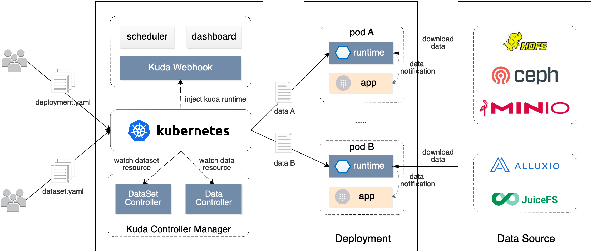

**Kuda** (**Ku**bernetes+**da**ta) 是 Kubernetes 原生的数据交付平台，为数据驱动型应用提供数据分发、滚动更新、版本管理等核心能力，实现对数据全生命周期的一站式管理。

## 核心功能

* **数据分发**: 通过描述应用数据的属性信息，将依赖的数据项分发到特定的目标实例，最终交付给应用加载使用。
* **缓存加速**: 引入 Alluxio 等分布式缓存组件，使应用数据更容易被访问和下载，提高数据处理速度。
* **亲和性调度**: 基于数据在各节点的分布情况，将应用实例优先调度到有数据的节点，降低数据多次下载带来的资源开销。
* **状态追踪**: 自动维护数据在分发过程中的状态信息，并由平台负责收集和上报，方便用户进行状态查询和追踪。
* **滚动更新**: 支持数据的版本管理和滚动更新，确保在数据异常时能够及时回滚，保证生产环境中的大规模应用。(建设中)
* **元数据管理**: 维护数据的交付状态、版本历史、节点分布等元数据，支持通过可视化界面进行查询和展示。(建设中)

## 项目特点

* **业务无侵入**: 将数据交付能力下沉到基础设施层，实现与业务层的解耦，无需对现有业务进行改造，提升业务的迭代效率。
* **数据全生命周期管理**: 提供对数据的交付使用、状态跟踪、查询展示等多方面的管理能力，贯穿数据的整个生命周期。
* **灵活对接多种工作负载**: 支持与任意类型的 Kubernetes 工作负载进行集成，即插即用，平台独立部署和维护。
* **支持多种数据源**: 原生支持 HDFS、Minio、Ceph 等数据源，预留数据源的扩展接口，方便快速集成。
* **适用于多种场景**: 满足AI、大数据等多种业务场景的需求，支持模型、配置、可执行文件等不同类型的数据交付。

## 技术架构

Kuda 是基于 Kubernetes 平台能力的扩展和延伸，遵循云原生的设计理念。目前主要包括 controller manager、webhook、runtime 三个组件:

* **Controller Manager**: 负责管理 DataSet 和 Data 两个 CRD 的生命周期，其中，DataSet 用于描述一组工作负载的数据依赖，Data 表示一个单独的工作负载实例对应的数据信息。
  该组件会根据 DataSet 的描述生成与实例数相同的 Data 资源，并最终完成数据的下发过程。
* **Webhook**: 自动为 DataSet 指定的目标实例注入 Runtime 容器，该组件基于 Kubernetes Mutating Webhook 实现，注入过程用户无感知，在业务无侵入的情况下实现对平台能力的增强。
* **Runtime**: 该组件以 Sidecar 的形式与业务容器部署在一起，用于根据当前实例对应的 Data 描述信息，下载各项数据，并将下载状态更新到 Data 对象，方便用户查询展示。
  数据下载完成后可以通过 lifecycle 通知业务容器，并由业务完成最新数据的加载和使用。
  
此外，为进一步丰富平台能力，我们正在规划 scheduler、dashboard 等组件，其中，scheduler 组件可以支持细粒度、多维度的亲和性调度策略，dashboard 组件将进一步降低平台使用门槛，提升用户体验。

## 手册

[概念介绍](./docs/concept.md)

[安装说明](./docs/install.md)

[快速开始](./docs/quick-start.md)

## 参与贡献

如何参与贡献请参考 [CONTRIBUTING](./CONTRIBUTING.md)。

## 许可

Kuda 使用 Apache 2.0 许可证，详见 [LICENSE](./LICENSE) 文件说明。

## 维护者

[OWNERS](./OWNERS)

## 联系我们

您在使用中如果遇到任何问题欢迎提交 [issues](https://github.com/kuda-io/kuda/issues) 进行反馈，也可以直接通过 kuda@bigo.sg 和我们联系。

